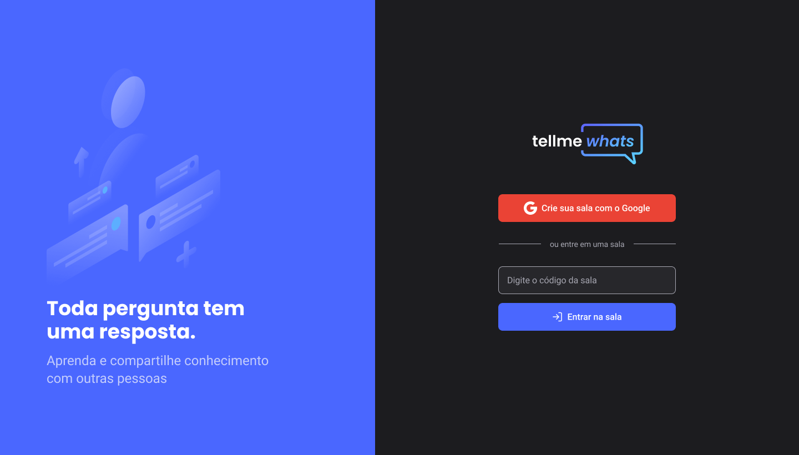
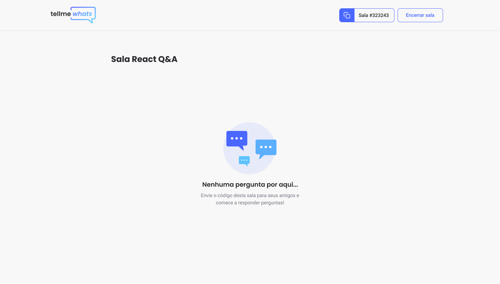
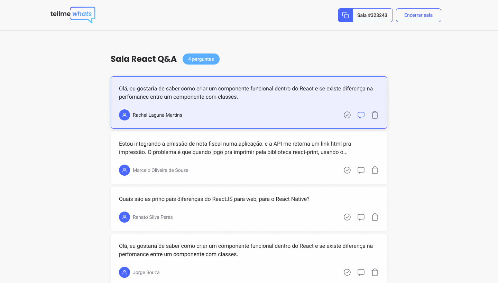
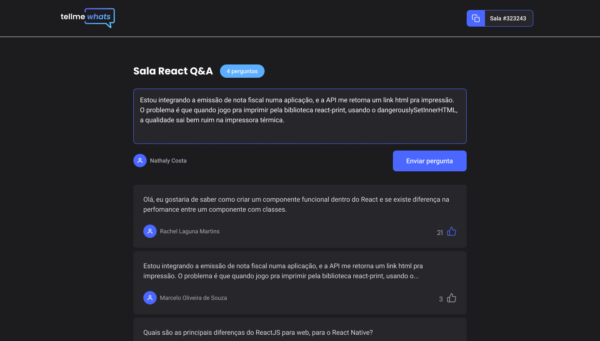

<h1 align="center">
  <a href="https://github.com/csorlandi/tell-me-whats">
    
  </a>
</h1>

<p align="center">Tell Me Whats is a project initially created to be a platform that allows users who stream to create a room so that other users can send questions to them, and with the platform the questions are organized and ordered so that none of them go unanswered, which often happens when you do a live for a lot of people.</p>

<p align="center">
  <a href="https://github.com/csorlandi">
    
  </a>

  

  

  
</p>

<p align="center">
  
  
  
  
</p>

---

## Table of Contents

<ul>
  <li><a href="#-features">Features</a></li>
  <li><a href="#-next-step-challenges">Chalenges</a></li>
  <li><a href="#-getting-started">Getting Started</a></li>
  <li><a href="#-contributing">Contributing</a></li>
  <li><a href="#-support">Support</a></li>
  <li><a href="#-license">License</a></li>
</ul>

---

## 📋 Features

### Documentation

- [ ] Work In Progress ...

### Build with

- [ReactJS](https://reactjs.org/) - A JavaScript library for building user interfaces
  - [Context API](https://reactjs.org/docs/context.html) - Context provides a way to pass data through the component tree without having to pass props down manually at every level.
  - [Hooks](https://reactjs.org/docs/hooks-faq.html) - Hooks are a new addition in React 16.8. They let you use state and other React features without writing a class.
- [Typescript](https://www.typescriptlang.org/) - TypeScript is an open-source language which builds on JavaScript, one of the world’s most used tools, by adding static type definitions.
- [Firebase](https://firebase.google.com/) - Firebase provides the tools to build high-quality applications, broaden your user base and profit more. We take care of the basics so you can generate revenue in the business and be dedicated to users.
  - [Firebase Realtime Database](https://firebase.google.com/docs/database) - The Firebase Realtime Database is a cloud-hosted database. Data is stored as JSON and synchronized in realtime to every connected client.
  - [Firebase Authentication](https://firebase.google.com/docs/auth) - Firebase Authentication provides backend services, easy-to-use SDKs, and ready-made UI libraries to authenticate users to your app. It supports authentication using passwords, phone numbers, popular federated identity providers like Google, Facebook and Twitter, and more.

---

## ⚔ Next Step Challenges

- [x] Create an Awesome (😎) Readme (📖)
- [x] Install and configure ESLint + Prettier + Editor Config (🛠)
- [ ] Use Styled Components instead of SCSS (🎛)
- [ ] Implement Theme Switcher (🌞 Light and Dark 🌚)
- [ ] Implement Private Routes (🔐) to some routes
- [ ] Use an Modal instead an alert to confirm question deletion (🗑)
- [ ] Don't allow (🚫) user join a closed room by url
- [ ] Try React Hook Form as a form manager (👨‍💼)
- [ ] Apply Responsivenes (🐱‍👤)
- [ ] Add PWA support (⬇)
- [ ] Try Helmet to dynamic headers (🤓)
- [ ] Implement Questions Tag Heatmap

---

## 🚀 Getting Started

### Prerequisites

- To run any ReactJS application you need to configure the environment on your machine.

- Setting the environment is a simple process, so it's recommended to follow the Rocketseat guide which is currently the most complete and detailed to make the settings:

  - ### [**Rocketseat Guide**](https://www.notion.so/Configura-es-do-ambiente-React-76f2963a042f45b9b9b567a2795945b8)

### Clone

- Clone this repo to your local machine using:

```
https://github.com/csorlandi/tell-me-whats
```

### Setup

- Install project dependencies;

  ```javascript
    yarn install
    // or
    npm install
    ```
- Configure Firebase;

  - To configure correctly it's recommendede to follow a step-by-step guide:

    - ### [**Firebase Setup Guide**](./readme/firebase-setup-guide.md)

- Configure local environment variables;

  - Change `.env.example` filename to `.env.local` and fill the variables inside it with Firebase Credentials.

- Run project in development mode;

  ```javascript
    yarn start
    // or
    npm run start
    ```

  > 💡 If your browser doesn't open the project automatically, open a new tab manually and access `http://localhost:3000`

- Be Happy! 😆

---

## 🤔 Contributing

> To get started...

### Step 1

- 🍴 Fork this repo!

### Step 2

- 👯  Clone this repo to your local machine using `https://github.com/csorlandi/tell-me-whats`

### Step 3

- 🎋  Create your feature branch using `git checkout -b my-feature`

### Step 4

- ✅  Commit your changes using `git commit -m 'feat: My new feature'`;

### Step 5

- 📌  Push to the branch using `git push origin my-feature`;

### Step 6

- 🔃  Create a new pull request

After your Pull Request is merged, can you delete your feature branch.

---

## 📌 Support

Reach out to me at one of the following places!

- Linktree at [@csorlandi](https://linktr.ee/csorlandi)
- Linkedin at [Claudio Orlandi](https://www.linkedin.com/in/csorlandi/)
- Youtube at [Claudio Orlandi](https://www.youtube.com/csorlandi)

---

## 📝 License


This project is licensed under the MIT License - see the [LICENSE](LICENSE) file for details.

---

Made with 💙  Enjoy it!
