# Firebase Setup Guide

## Go to Firebase Console

- Access [**Firebase Console**](https://console.firebase.google.com) and signin with an Google Account;

## Create a project in Firebase Console

- Follow the steps below:

  <p align="center">
    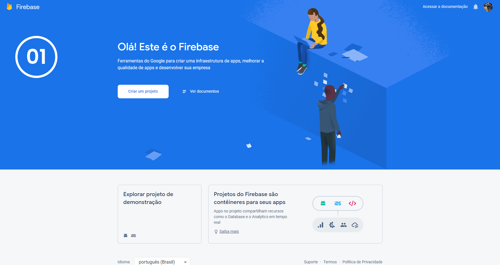
    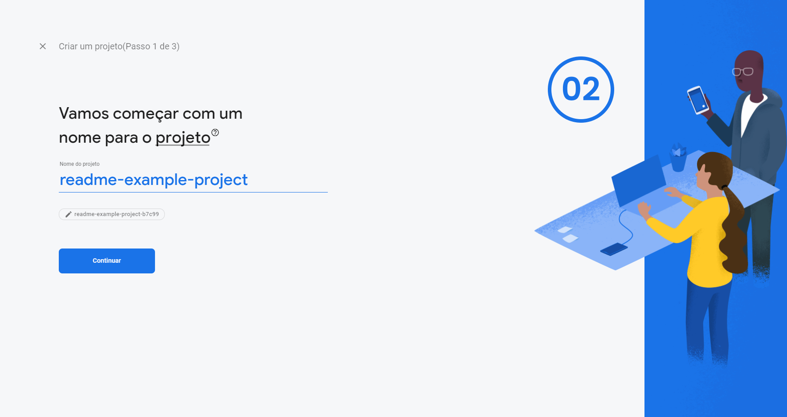
    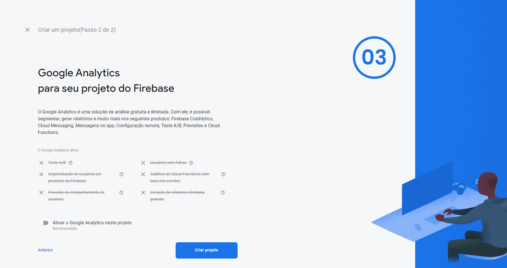
    
  </p>

## Configure Firebase Project Credentials

- Follow the steps below:

  <p align="center">
    
    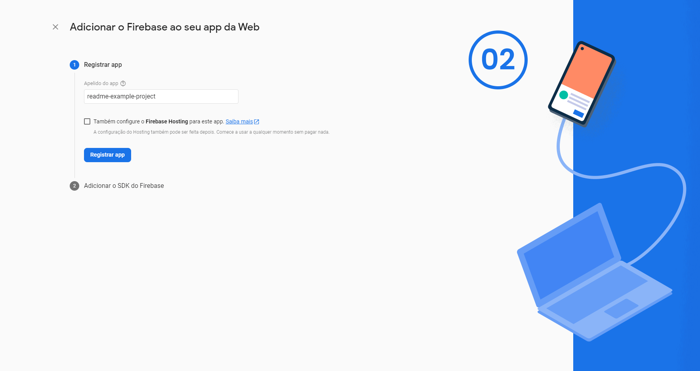
    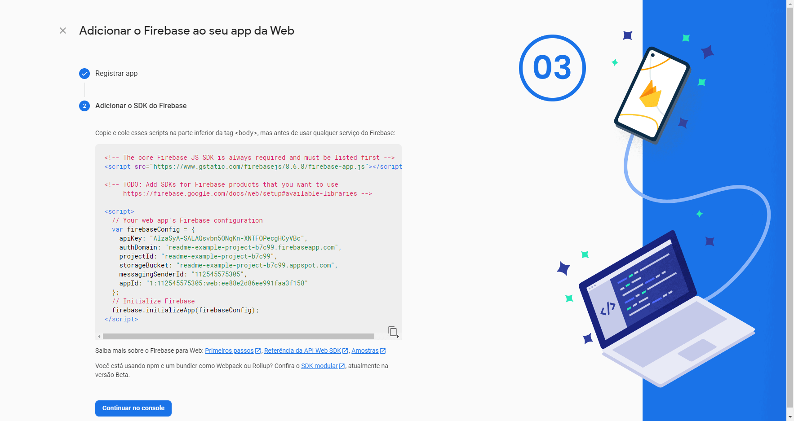
  </p>

  ### 🚧 Save the credentials from last image to use in a step ahead!

## Apply Firebase Database rules

- Follow the steps below:

  <p align="center">
    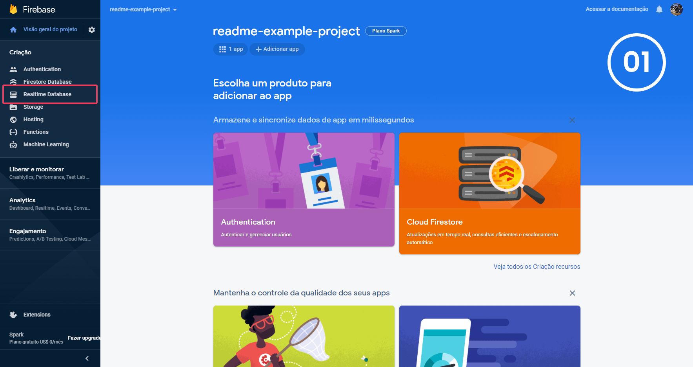
    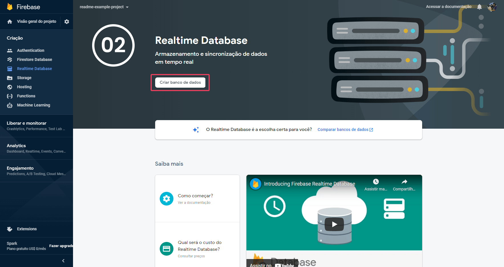
    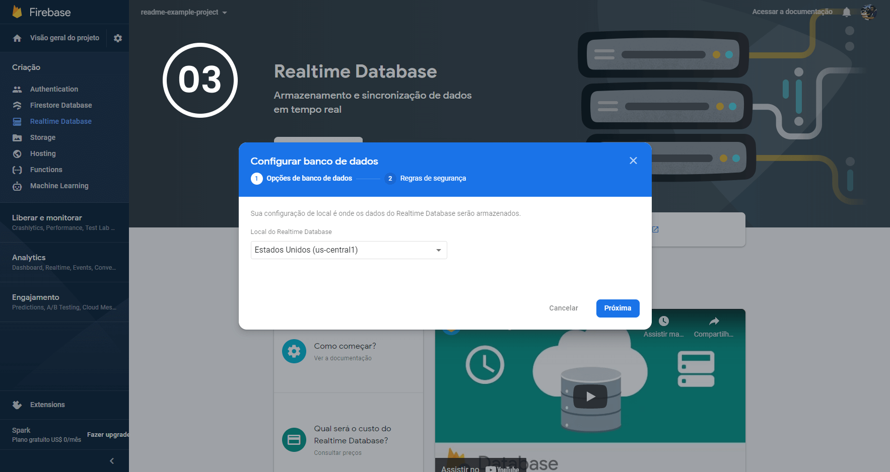
    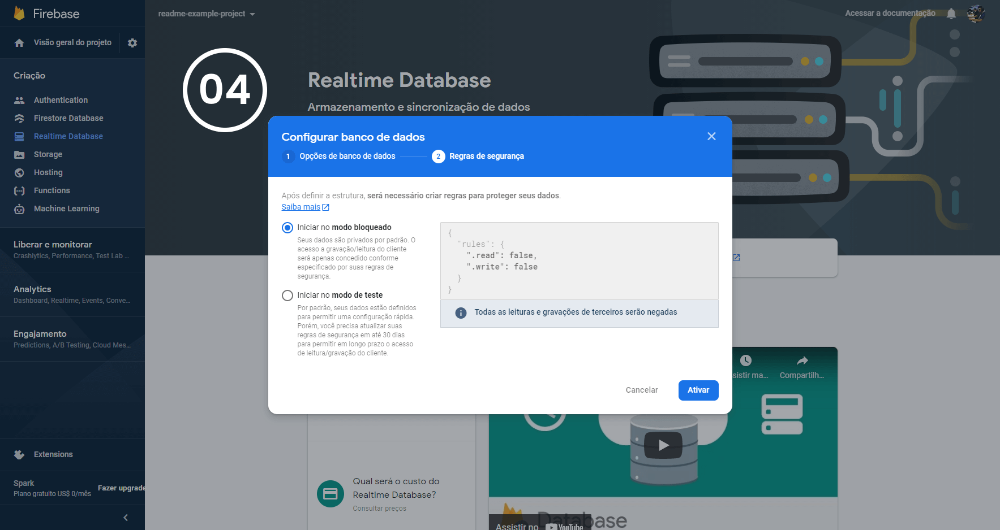
    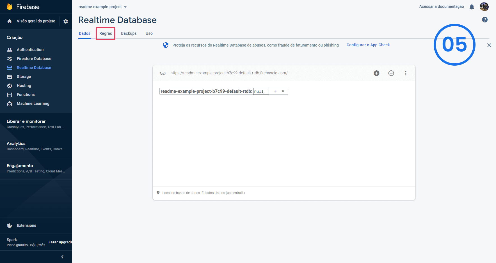
    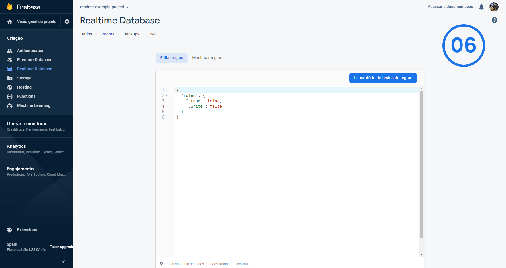
  </p>

  - Paste the following rules in last screen input:
    ```json
    {
      "rules": {
        "rooms": {
          ".read": false,
          ".write": false,
          "$roomId": {
            ".read": "!root.child('/rooms/' + $roomId + '/endedAt').exists() || data.child('authorId').val() == auth.uid ",
            ".write": "auth != null && (!data.exists() || data.child('authorId').val() == auth.uid)",
            "questions": {
              ".read": "!root.child('/rooms/' + $roomId + '/endedAt').exists()",
              ".write": false,
                "$questionId":{
                  ".read": true,
                      ".write": "auth != null && !root.child('/rooms/' + $roomId + '/endedAt').exists() && (!data.exists() || data.child('author/id').val() == auth.uid)",
                  "likes": {
                    ".read": true,
                    ".write": "auth != null"
                  }
                }
            }
          }
        }
      }
    }
    ```
  - Click on the `Publish` button to save the rules:

  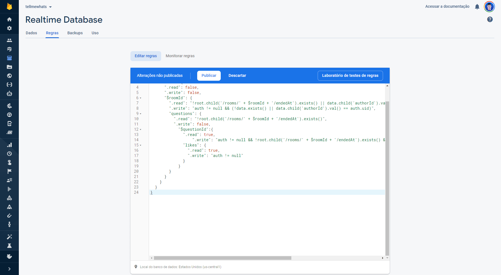

### Go Back to [**Readme Setup Section**](../README.md#setup)